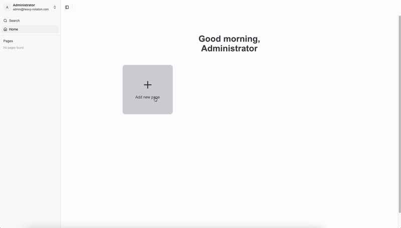

  

  Minimal note-taking web application inspired by Notion.

  <a href="https://heavynotation.vercel.app">
    Demo
  </a>

> Note that the company logos in the "Trusted by teams at" section on the home page are used only for demonstration purposes and do not imply any real-world endorsement or affiliation.

## 📚 Table of Contents

- [About](https://github.com/gattigaga/heavy-notation/tree/main?tab=readme-ov-file#-about)
- [Motivation](https://github.com/gattigaga/heavy-notation/tree/main?tab=readme-ov-file#-motivation)
- [Tech Stacks](https://github.com/gattigaga/heavy-notation/tree/main?tab=readme-ov-file#%EF%B8%8F-tech-stacks)
- [Other Resources](https://github.com/gattigaga/heavy-notation/tree/main?tab=readme-ov-file#-other-resources)
- [License](https://github.com/gattigaga/heavy-notation/tree/main?tab=readme-ov-file#-license)

## 🚀 About

Heavy Notation is a minimal note-taking web application inspired by Notion, designed as a learning project to explore modern frontend web development technologies. While not a full-featured clone, it demonstrates core note-taking functionality with a simple, clean approach.

Key features include:

- 📝 Basic page creation and management
- 🧩 Simple block-based content editing
- 🔍 Basic search functionality
- 🔐 User authentication
- 🌐 Client-side localization
- 📱 Responsive design
- 🌅 Toggle light/dark mode

The project serves as a practical exploration of frontend development concepts, showcasing fundamental note-taking application capabilities.

## 💡 Motivation

Heavy Notation is more than just a note-taking app—it's my playground for exploring modern web technologies and pushing my frontend development skills.

Inspired by tools like Notion, I wanted to create an application that demonstrates:

- 🧩 Complex state management
- ✨ Seamless user interactions
- 🚀 Modern React ecosystem best practices
- 📱 Responsive web design

## 🛠️ Tech Stacks

The project is built using the following tech stacks:

- [Next.js](https://nextjs.org)
- [TypeScript](https://www.typescriptlang.org)
- [Tailwind CSS](https://tailwindcss.com)
- [Prisma](https://www.prisma.io)
- [Auth.js](https://authjs.dev)
- [Shadcn UI](https://ui.shadcn.com)
- [Next Safe Action](https://next-safe-action.dev)
- [Sentry](https://sentry.io)
- [Cloudinary](https://cloudinary.com)
- [Turso](https://turso.tech)
- [Lingui.js](https://lingui.dev)
- [Lucide Icons](https://lucide.dev)
- [Yoopta](https://yoopta.dev)
- [Zod](https://zod.dev)
- [React Hook Form](https://react-hook-form.com)
- [React Query](https://tanstack.com/query/latest)
- [Luxon](https://moment.github.io/luxon)
- [ESLint](https://eslint.org)
- [Prettier](https://prettier.io)
- [Husky](https://typicode.github.io/husky)
- [Lint Staged](https://github.com/okonet/lint-staged)

## 🌟 Other Resources

- [How to Run Locally](./docs/how-to-run-locally.md)
- [How to Setup Turso](./docs/how-to-setup-turso.md)
- [How to Deploy on Vercel](./docs/how-to-deploy-on-vercel.md)

## 📝 License

This project is licensed under the Creative Commons Attribution-NonCommercial 4.0 International License. See the [LICENSE](./LICENSE) file for details.
