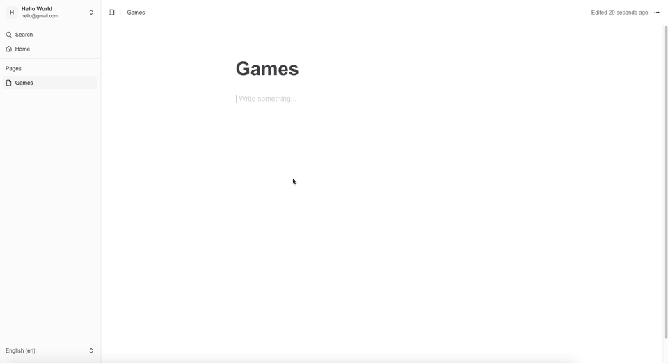

  

  Minimal note-taking web application inspired by Notion.

  <a href="https://heavynotation.vercel.app">
    Demo
  </a>

> Note that the company logos in the "Trusted by teams at" section on the home page are used only for demonstration purposes and do not imply any real-world endorsement or affiliation.

## 📚 Table of Contents

- [About](https://github.com/gattigaga/heavy-notation/tree/main?tab=readme-ov-file#-about)
- [Motivation](https://github.com/gattigaga/heavy-notation/tree/main?tab=readme-ov-file#-motivation)
- [Tech Stacks](https://github.com/gattigaga/heavy-notation/tree/main?tab=readme-ov-file#%EF%B8%8F-tech-stacks)
- [Other Resources](https://github.com/gattigaga/heavy-notation/tree/main?tab=readme-ov-file#-other-resources)
- [License](https://github.com/gattigaga/heavy-notation/tree/main?tab=readme-ov-file#-license)

## 🚀 About

Heavy Notation is a minimal note-taking web application inspired by Notion, designed as a learning project to explore modern frontend web development technologies. While not a full-featured clone, it demonstrates core note-taking functionality.

Key features include:

- 📝 Page creation and management
- 🧩 Block-based content editing
- 🔍 Quick page search
- 🔐 Authentication with email and Google
- 🌐 Internationalization
- 📱 Responsive across viewport
- 🌅 Toggle light/dark mode

## 💡 Motivation

I built Heavy Notation to grow my frontend skills and try out modern web dev tools. Inspired by Notion’s clean design, I worked on adding user auth, managing dynamic state, and making it responsive across devices, among other things.

## 🛠️ Tech Stacks

The project is built using the following tech stacks:

[Next.js](https://nextjs.org):
Next.js is a popular React framework that provides a lot of features out of the box, such as server-side rendering and static site generation. It also has good documentation and supports modern React features like React Server Components.

[TypeScript](https://www.typescriptlang.org):
TypeScript is a powerful tool that adds static typing to JavaScript. It helps catch type-related errors in development process, which improves code quality and reduces debugging time. With TypeScript integrated into VSCode, we can enjoy features like autocompletion and type checking.

[Tailwind CSS](https://tailwindcss.com):
Tailwind CSS has pre-made classes that we can use to style our components. Most of the time, we can style directly on the HTML using Tailwind CSS pre-made classes, we don't need to think about creating custom classes, and it's tiny on the production.

[Prisma](https://www.prisma.io):
As an ORM, Prisma streamlines database interactions, supporting both local SQLite and Turso's online database. Its type safety enhances development efficiency and reduces runtime errors.

[Auth.js](https://authjs.dev):
This library simplifies user authentication by providing a wide range of OAuth providers, including Google. Its seamless integration with Next.js enhances the overall user experience.

[Shadcn UI](https://ui.shadcn.com):
Shadcn UI delivers a collection of beautiful, customizable UI components that work effortlessly with Tailwind CSS and Next.js, ensuring a cohesive design aesthetic.

[Next Safe Action](https://next-safe-action.dev):
This tool ensures type-safe server actions, allowing us to manage server-side logic with confidence and reducing the likelihood of errors. It also has states that represents the action status like isPending, a bit similar to React Query that we used for data fetching.

[Sentry](https://sentry.io):
Sentry is utilized for real-time error tracking and application monitoring, enabling us to quickly identify and resolve issues, thus enhancing application reliability.

[Cloudinary](https://cloudinary.com):
Cloudinary is used to store and manage images, providing a reliable and free service for uploading and accessing images.

[Turso](https://turso.tech):
Turso serves as a free online database service, providing a reliable backend solution for our application without incurring additional costs.

[Lingui.js](https://lingui.dev):
Lingui.js facilitates internationalization, streamlining the process of extracting and compiling translations, which is essential for reaching a global audience.

[Lucide Icons](https://lucide.dev):
Lucide Icons is chosen for its aesthetic appeal and compatibility with Shadcn UI, enhancing the visual quality of our application.

[Yoopta](https://yoopta.dev):
Yoopta is leveraged to create a block-based editor similar to Notion, offering extensibility and a variety of block types, which enriches the user experience.

[Zod](https://zod.dev):
Zod is implemented for data validation, ensuring that both form inputs and server actions are rigorously checked.

[React Hook Form](https://react-hook-form.com):
This library excels at managing form data, streamlining the process of handling user inputs.

[React Query](https://tanstack.com/query/latest):
React Query is used for data fetching and mutations, providing a powerful and declarative way to manage server state in our application.

[Luxon](https://moment.github.io/luxon):
Luxon is used for date and time formatting, offering a modern API that simplifies handling date manipulations.

[ESLint](https://eslint.org):
ESLint is used to enforce coding standards, ensuring code quality and consistency throughout the project.

[Prettier](https://prettier.io):
By integrating Prettier into the development workflow, we enhance code readability and reduce the time spent on manual formatting.

[Husky](https://typicode.github.io/husky):
Husky is utilized to enforce pre-commit hooks, allowing us to run scripts before Git commits. This ensures that code quality checks and other necessary tasks are completed automatically, enhancing the development workflow.

[Lint Staged](https://github.com/okonet/lint-staged):
Lint Staged is employed to run linters on staged files before committing. This ensures that only properly formatted and error-free code is committed, maintaining high code quality and consistency throughout the project.

## 🌟 Other Resources

- [How to Run Locally](./docs/how-to-run-locally.md)
- [How to Setup Turso](./docs/how-to-setup-turso.md)
- [How to Deploy on Vercel](./docs/how-to-deploy-on-vercel.md)

## 📝 License

This project is licensed under the Creative Commons Attribution-NonCommercial 4.0 International License. See the [LICENSE](./LICENSE) file for details.
