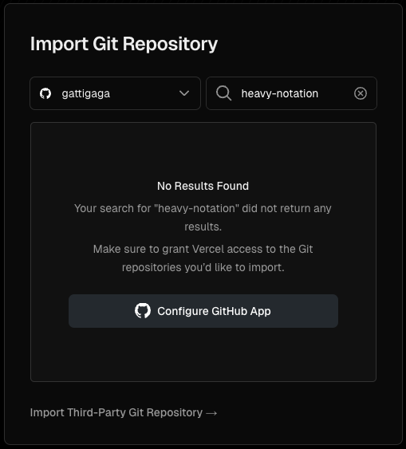
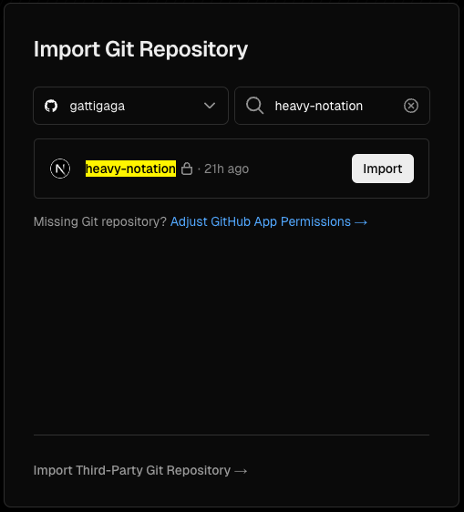
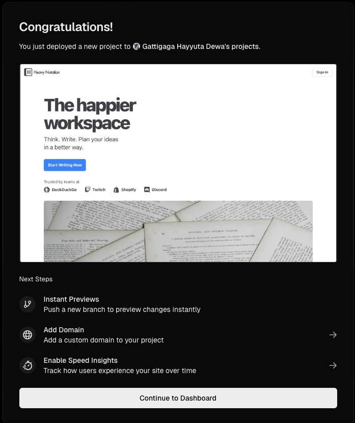
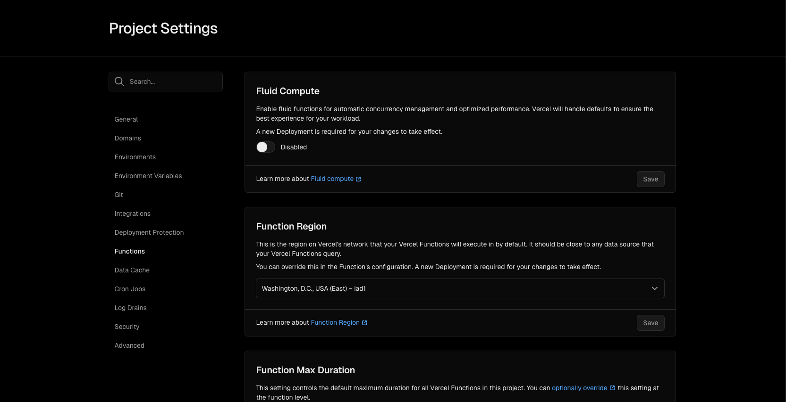
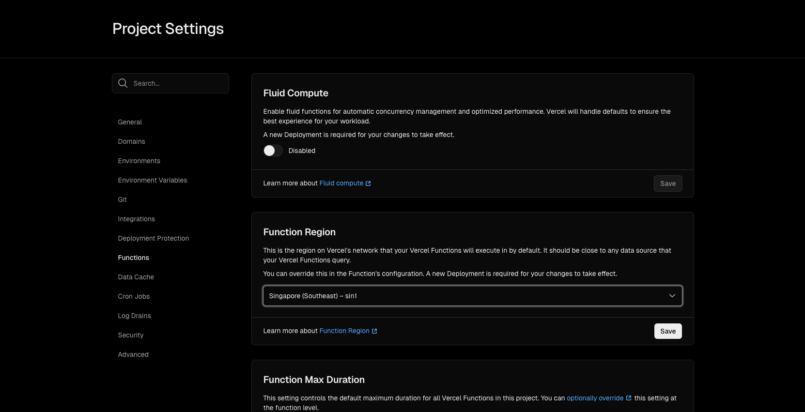
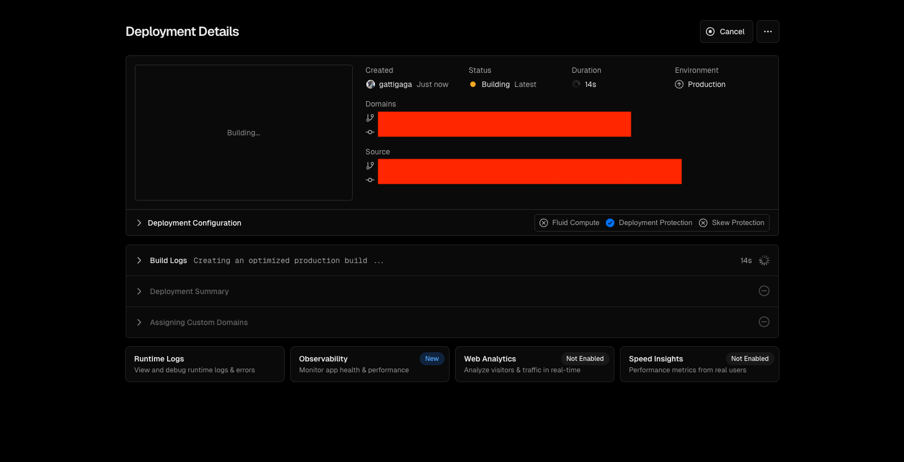
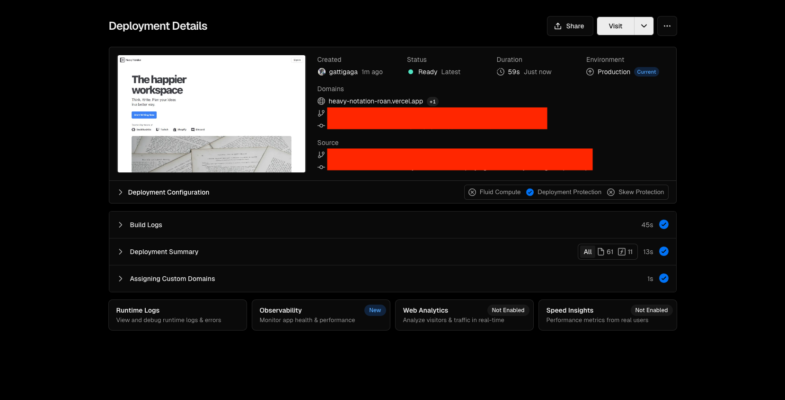
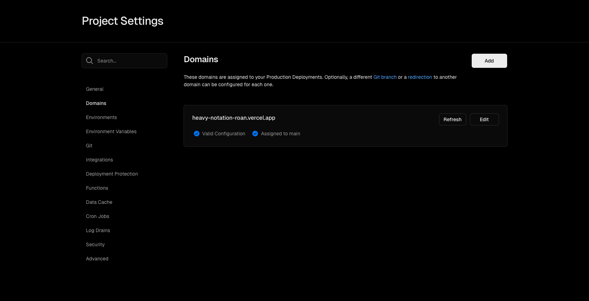
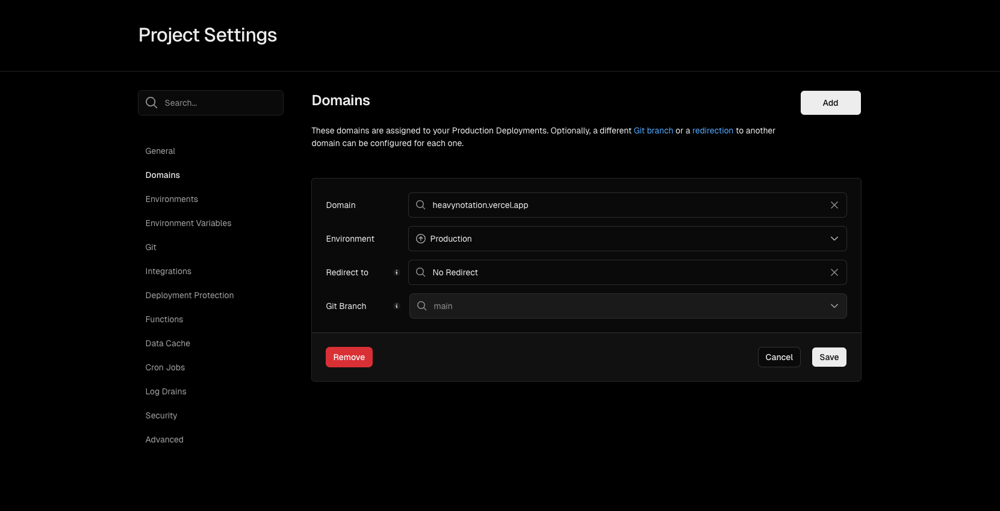

# How to Deploy on Vercel

This is a guide for deploy this project production on Vercel.

## Prerequisites

Prepare your environment variables first in `.env.production` file and make sure all these variables has value. Later we need to copy it to Vercel when we deploy.

```
TURSO_DATABASE_URL=
TURSO_AUTH_TOKEN=
AUTH_SECRET=
AUTH_GOOGLE_ID=
AUTH_GOOGLE_SECRET=
SENTRY_AUTH_TOKEN=
SENTRY_ORG=
SENTRY_DSN=
```

## Deployment

Follow these steps to deploy this project on Vercel.

1. Import this project on Vercel from GitHub. If we can't found it, you need to configure it to allow Vercel to access the repo of this project from GitHub.




2. Fill up production environment variables here and click "Deploy" button. You can copy from your `.env.production` file and paste it in this form.


3. After clicking "Deploy" button, wait for the build to complete and you will be redirected to the Congratulations page.



## Change Server Region

I need to do change the server region from United States to Singapore because I want this Vercel server to be closer to the Turso database server that I did created in Singapore. This will decrease the latency between the server and the database server.

Follow these steps to change the server region from United States to Singapore.

1. Go to Project Settings page and click on the Functions menu on the left.

2. Find Function Region section, and change the region from "Washington, D.C., USA (East) - iad1" to "Singapore (Southeast) - sin1". Then click on the "Save" button.




3. When you click on the "Save" button, you will be asked to redeploy the project.

4. In the Redeploy popup, add checkmark to the "Use existing Build Cache" to make the redeploy faster. Then click on the "Redeploy" button.


5. After clicking "Redeploy" button, wait for the redeploy to complete.




## Change Domain

I want to change the default domain that Vercel created `heavy-notation-roan.vercel.app` to `heavynotation.vercel.app`. Actually, I want to have `heavy-notation.vercel.app` because it's easier to read but it turns out the domain is already used by someone.

Follow these steps to change the domain.

1. Go to Project Settings page and click on the Domain menu on the left.



2. Change the domain name in this form and click on the "Save" button.



