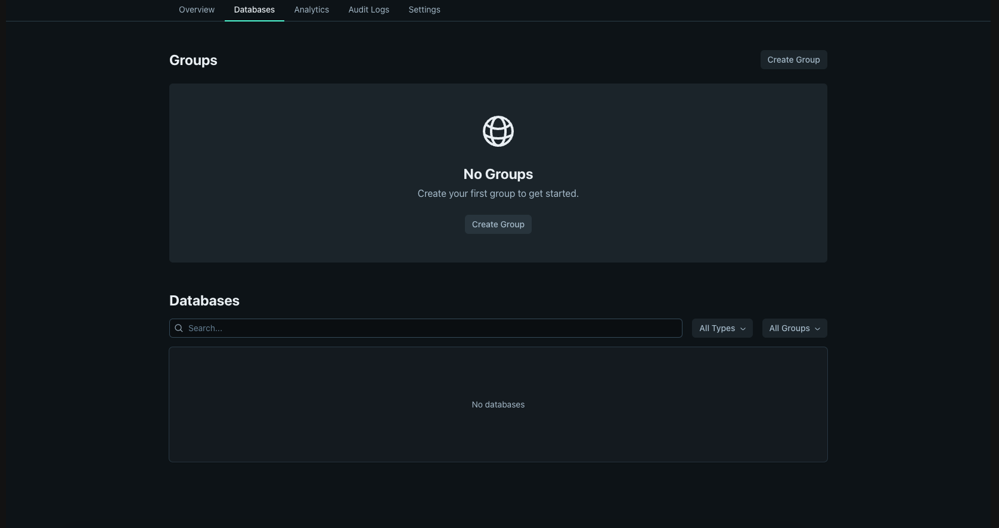
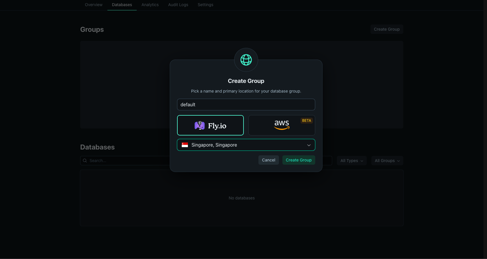
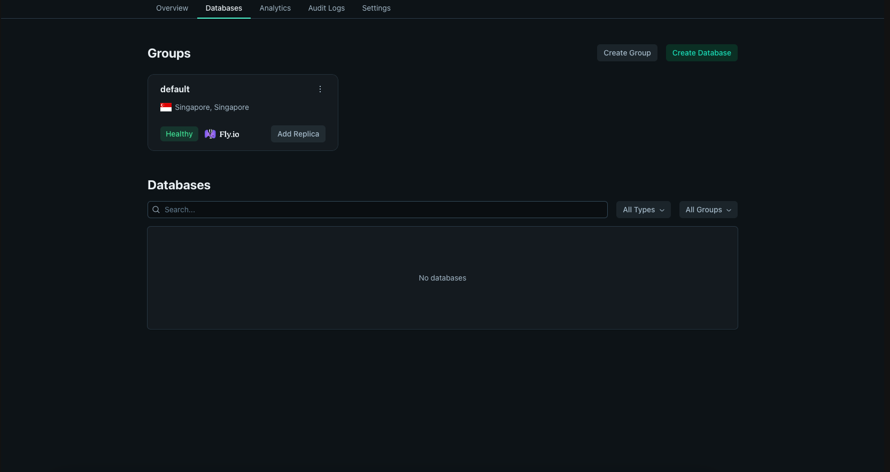
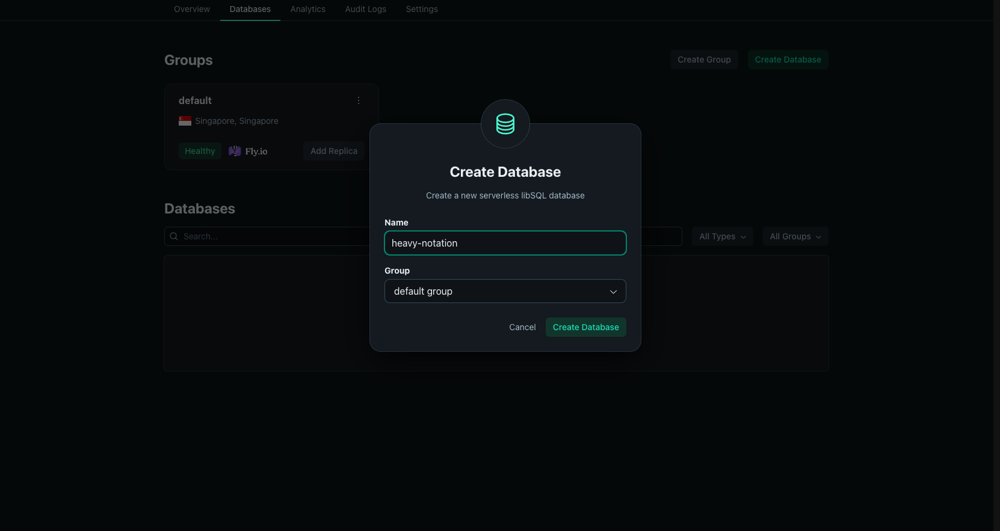
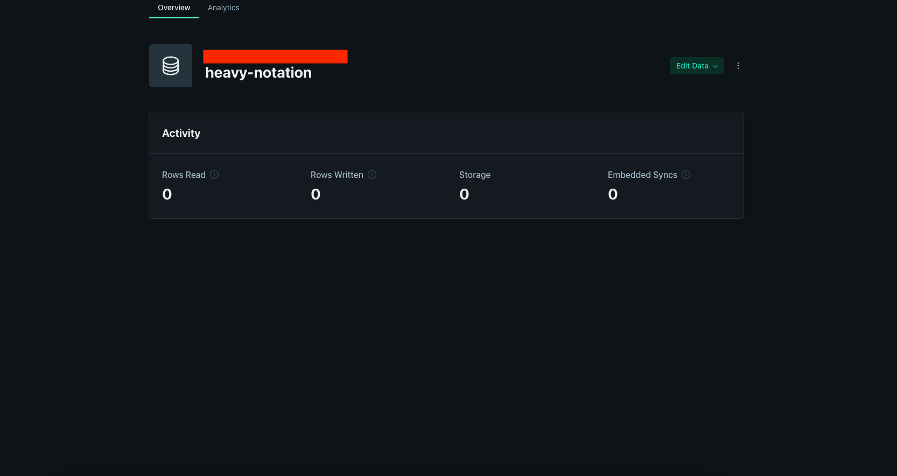
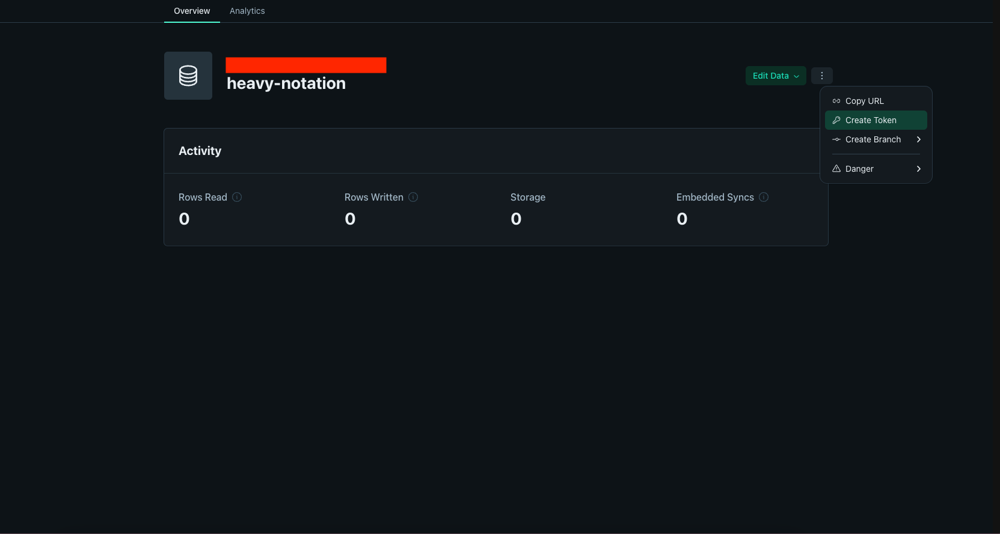
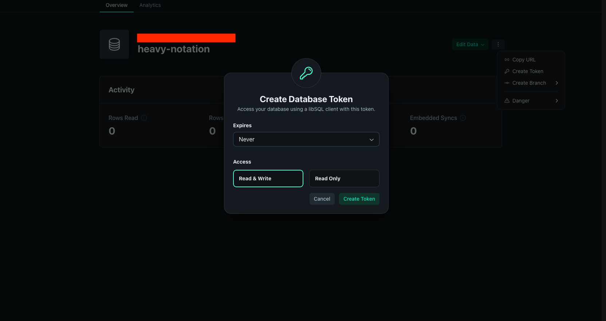
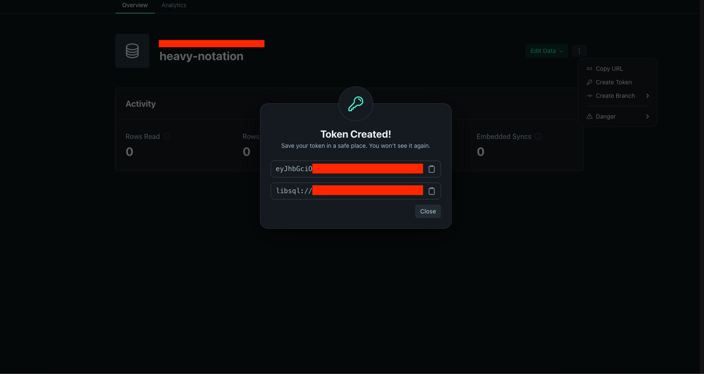

# How to Setup Turso

This guide is for setting up the database for this project on Turso.

## Steps

1. Sign in to your Turso account [here](https://app.turso.tech/login). If you have no account yet, you can sign up first.

2. Create a new group and choose a region for this group. So the database that use this group will be in the chosen region. In this case, I choose Singapore because it's closest to me (Indonesia).





3. Create a new database for that group. In this case, I create a new database named `heavy-notation`.




4. Now, we need to create a new token so that we can connect to the database from our project. In this case, I set the token to never expire and it should allows my project to read and write to the database.




5. It will generate the token and database url.



6. Copy paste the token and database url to the `.env.production` file. If you have not created the `.env.production` file yet, create it first.

```
TURSO_DATABASE_URL=libsql://my-project.turso.io
TURSO_AUTH_TOKEN=my.project.auth.token
```
