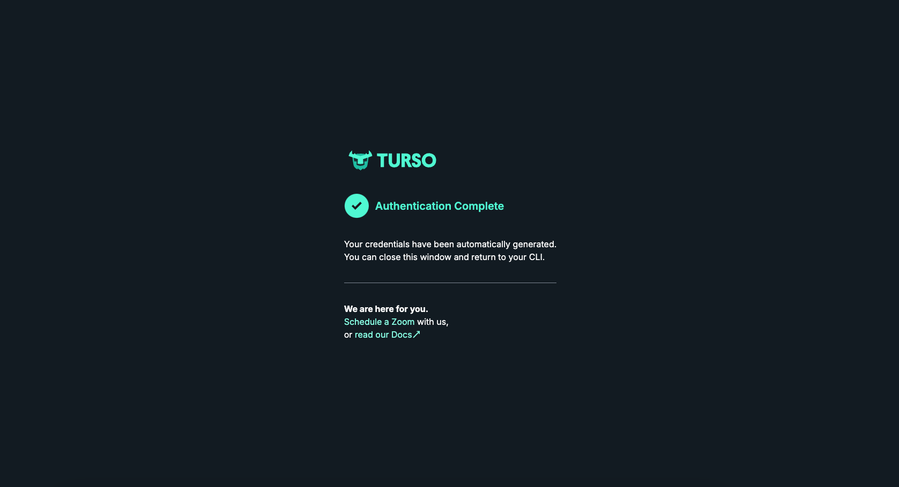

# How to Setup Turso

This guide is for setting up the database for this project on Turso.

## Steps

1. Sign in to your Turso account [here](https://app.turso.tech/login). If you have no account yet, you can sign up first.

2. Create a new group and choose a region for this group. So the database that use this group will be in the chosen region. In this case, I choose Singapore because it's closest to me (Indonesia).


3. Create a new database for that group. In this case, I create a new database named `heavy-notation`.


4. Now, we need to create a new token so that we can connect to the database from our project. In this case, I set the token to never expire and it should allows my project to read and write to the database.


5. It will generate the token and database url.


6. Copy paste the token and database url to the `.env.production` file. If you have not created the `.env.production` file yet, create it first.

```
TURSO_DATABASE_URL=libsql://my-project.turso.io
TURSO_AUTH_TOKEN=my.project.auth.token
```

7. Install Turso CLI on your local machine by following this [official guide](https://docs.turso.tech/quickstart).

8. After install it, sign in to your account by running this command on your terminal:

```bash
turso auth login
```

Follow the instructions until you see this success message.



After you're authenticated, you can interact with your database on Turso from your terminal.

9. After you did all of that steps, you will be able to apply the migrations that you already created to your Turso database one by one by running this command on your terminal:

```bash
pnpm production:db-shell < path/to/migration.sql
```

For example:

```bash
pnpm production:db-shell < ./prisma/migrations/20250222185232_add_body_field_in_page_model_and_remove_block_model/migration.sql
```

You need to do it one by one for each of migration files in the correct order. [This is what Prisma said in their documentation](https://www.prisma.io/docs/orm/overview/databases/turso#how-to-manage-schema-changes).